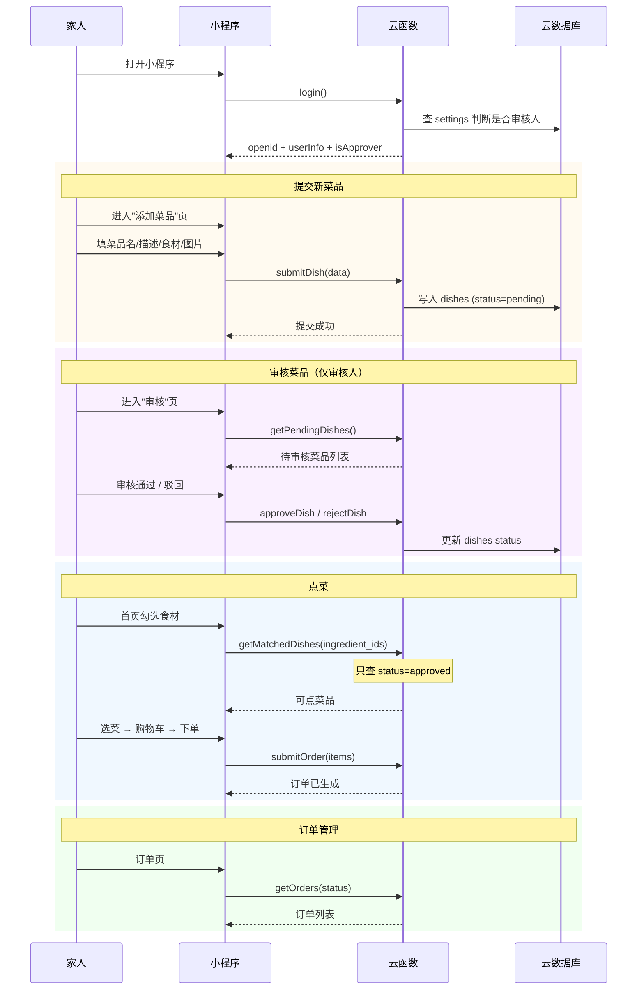

# 智能点菜小程序 Design

> Stage 1 | 2026-07-01

## 0. 术语约定

| 术语 | 定义 | 防冲突 |
|---|---|---|
| 食材 (Ingredient) | 菜品的原材料，如"鸡蛋""西红柿" | 项目全新，无冲突 |
| 菜品 (Dish) | 由若干食材组成的可点菜肴，如"番茄炒蛋" | — |
| 待审核 (pending) | 家人提交了但做饭的人还没确认的菜品，不出现在点菜列表中 | — |
| 已上架 (approved) | 审核通过的菜品，可以在首页被匹配和点选 | — |
| 已驳回 (rejected) | 审核未通过的菜品，提交人可以看到驳回状态 | — |
| 审核人 (approver) | 家里负责审核菜品的人（做饭的人），由开发者在云开发控制台设置，显示微信头像和昵称便于辨认 | — |
| 驳回重提 (resubmit) | 被驳回的菜品，提交人修改后可重新提交审核，状态回到 pending | — |
| 订单 (Order) | 一次点菜记录，包含下单人和所选菜品 | — |

## 1. 决策与约束

### 需求摘要

- **做什么**：家庭内部微信小程序。家人可以提交新菜品建议；审核人审核通过后菜品上架；家人按食材筛选可做菜品 → 勾选点菜 → 生成订单 → 查看历史订单
- **为谁**：自己家人（3-10 人规模）
- **成功标准**：家人能日常使用它完成"今天吃什么"的决策和记录，菜品池能靠家人贡献持续丰富
- **明确不做**：食材库存管理、营养搭配分析、采购清单、支付、独立账号体系、多家庭/多租户、UGC/评论、编辑已上架的菜品（已上架菜品不可修改，如需改由审核人驳回→提交人修改→重新审核）

### 复杂度档位

走默认档位，无偏离。理由：B 规模、单用户组、低并发、无支付、无实时协作需求。

### 关键决策

| 决策 | 选择 | 原因 |
|---|---|---|
| D1：跨端框架 | uni-app Vue 3 + CLI/Vite | 保留 Vue 3 全生态，编译到微信小程序，后期可跨端 |
| D2：后端 | 微信云开发（云函数 + 云数据库 + 云存储） | 小规模几乎免费，免备案运维，微信登录天然打通 |
| D3：状态管理 | Pinia | Vue 3 官方推荐，购物车/用户态/订单列表/菜品管理天然拆分 |
| D4：UI 组件 | uni-ui | 和 uni-app 零摩擦，覆盖本项目所需基础组件 |
| D5：菜品数据来源 | 家人众包提交 + 审核人审核上架 | 家庭菜品池几十道，家人自己提交最贴近实际需求，审核制保证数据质量 |
| D6：分包策略 | 主包（首页+食材选择+菜品提交）+ 分包（订单+历史+审核） | 主包控制体积保证首次加载快 |
| D7：审核权限模型 | 指定审核人制——`settings` 集合中存储审核人列表（含 openid + 微信昵称 + 头像），审核人可审核自己提交的菜品（家庭信任模型） | 家庭场景 1-2 个固定审核人（做饭的人），不建角色系统；显示微信信息便于辨认谁是谁 |

### 关键假设

- **假设 1**：家庭内部使用，不需要权限分级——所有成员看到相同的已上架菜品池、可以互相看到订单。**唯一的权限差异是审核人**（由开发者在云开发控制台手动配置 openid，改动不频繁）
- **假设 2**：菜品数据由家人提交、审核人审核。审核人可审核自己提交的菜品（家庭信任模型，不做自审限制）
- **假设 3**：微信登录获取的 openid、昵称、头像足以作为用户标识。新增 `users` 集合在每次登录时缓存用户基本信息，供审核人列表等位置显示
- **假设 4**：提交菜品时上传的图片为可选——不强制要求图片，emoji 或文字描述也可以

### Top 3 风险

| 风险 | 缓解 |
|---|---|
| R1：uni-app 编译到微信小程序的兼容性问题 | Step 1 先用骨架页面跑通完整编译→预览链路，锁定可用 API |
| R2：云数据库权限配置过宽导致数据泄露 | Step 7 harden 覆盖数据库权限规则验证 |
| R3：菜品图片上传可能超出云存储免费额度 | Step 6 限制图片大小（前端压缩 + 云存储上传前校验），家庭场景用量不大 |

### 非显然依赖

- 微信开发者工具（预览调试必需）
- 微信云开发开通（云函数 + 云数据库 + 云存储）
- 微信小程序 AppID（注册 + 云开发开通）
- 审核人 openid 需在云开发控制台手动写入 `settings` 集合

---

## 2. 名词与编排

### 2.1 名词层

**现状**：无现状，全新项目。

**变化**：以下全部新建。

#### 云数据库集合

**`ingredients` — 食材**

```js
{
  _id: string,          // 自动生成
  name: string,         // "鸡蛋"、"西红柿"
  category: string,     // "蔬菜"、"肉类"、"调味" 等大类
  icon: string,         // 可选 emoji 或云存储图片 fileID
  createdAt: Date
}
```

**`dishes` — 菜品**

```js
{
  _id: string,
  name: string,               // "番茄炒蛋"
  description: string,        // 一句话描述
  image: string,              // 可选，云存储 fileID
  cooking_time: number,       // 预估烹饪时间（分钟）
  ingredient_ids: string[],   // 关联食材 _id 数组
  status: 'pending' | 'approved' | 'rejected',
  submitted_by: string,       // 提交人 openid
  submitted_by_name: string,  // 提交人微信昵称（冗余）
  submitted_at: Date,
  approved_by: string,        // 审核人 openid（approved/rejected 时有值）
  approved_at: Date,          // 审核时间
  createdAt: Date
}
```

**`orders` — 订单**（无变化）

```js
{
  _id: string,
  user_openid: string,
  user_name: string,
  items: [{ dish_id: string, dish_name: string, quantity: number }],
  status: 'active' | 'completed' | 'cancelled',
  created_at: Date,
  completed_at: Date,
}
```

**`settings` — 系统配置**（新增）

```js
{
  _id: "approvers",                    // 固定 key
  approvers: [
    {
      openid: "openid_xxx",
      nickName: "张三",
      avatarUrl: "https://...",
    }
  ],
}
```

**`users` — 用户基本资料缓存**（新增）

```js
{
  _id: openid,          // 直接用 openid 作为 _id
  nickName: string,
  avatarUrl: string,
  lastLoginAt: Date,
}
```
// 每次 login 云函数调用时 upsert，供审核人列表等位置显示用户信息

#### 前端 Pinia Store

**`useMenuStore`** — 菜品浏览状态

```js
// 状态
{
  ingredients: Ingredient[],
  selectedIngredientIds: Set<string>,
  dishes: Dish[],              // 只含 status === 'approved' 的菜品
  loading: boolean,
}

// 关键操作
{
  fetchAllIngredients(): Promise<void>,
  toggleIngredient(id: string): void,
  fetchMatchedDishes(): Promise<void>,
}
```

**`useCartStore`** — 点菜购物车（无变化）

```js
// 状态: { items: { dish_id, dish_name, quantity }[] }
// 关键操作: addDish / removeDish / updateQuantity / clear / totalCount getter
```

**`useOrderStore`** — 订单管理（无变化）

```js
// 状态: { currentOrders: Order[], historyOrders: Order[] }
// 关键操作: submitOrder / fetchActiveOrders / fetchHistoryOrders / completeOrder
```

**`useUserStore`** — 用户状态（扩展）

```js
// 状态
{
  openid: string | null,
  userInfo: { nickName: string, avatarUrl: string } | null,
  isLoggedIn: boolean,
  isApprover: boolean,          // 新增：当前用户是否为审核人
}

// 关键操作
{
  login(): Promise<void>,       // 登录时同步判断 isApprover
}
```

**`useDishManageStore`** — 菜品管理（新增）

```js
// 状态
{
  pendingDishes: Dish[],        // 待审核菜品列表（仅审核人可见）
  mySubmissions: Dish[],        // 我提交的菜品及审核状态
}

// 关键操作
{
  submitDish(dishData): Promise<void>,
  fetchPendingDishes(): Promise<void>,      // 审核人用
  approveDish(dish_id: string): Promise<void>,
  rejectDish(dish_id: string): Promise<void>,
  fetchMySubmissions(): Promise<void>,      // 提交人查看自己提交的
}
```

#### 关键接口示例

**云函数 `getMatchedDishes`**（更新：只返回 approved 菜品）

```
// 来源：cloudfunctions/getMatchedDishes/index.js

输入: { ingredient_ids: string[] }
输出: {
  dishes: [{ _id, name, description, image, cooking_time, matched_count, total_count }]
}
错误: { code: "EMPTY_INGREDIENTS", message: "请先选择食材" }
```

**云函数 `submitDish`**（新增）

```
// 来源：cloudfunctions/submitDish/index.js

输入: {
  name: "番茄炒蛋",
  description: "家常下饭菜",
  image: "cloud://xxx",          // 可选
  cooking_time: 15,
  ingredient_ids: ["ing_001", "ing_002"],
}

输出: { success: true, dish: { _id: "dish_001", ...完整 dish } }

错误:
  { code: "NOT_LOGGED_IN" }
  { code: "MISSING_FIELDS", message: "菜品名和食材不能为空" }
  { code: "DUPLICATE_NAME", message: "已存在同名菜品" }
```

**云函数 `approveDish`** / `rejectDish`**（新增）

```
// 来源：cloudfunctions/approveDish/index.js

输入: { dish_id: "dish_001" }
输出: { success: true, dish: { ...更新后的 dish } }

错误:
  { code: "NOT_APPROVER", message: "只有审核人可以审核菜品" }
  { code: "ALREADY_REVIEWED", message: "该菜品已被审核" }
```

**云函数 `resubmitDish`**（新增）

```
// 来源：cloudfunctions/resubmitDish/index.js
// 仅允许原提交人编辑被驳回的菜品，重新提交审核

输入: { dish_id, name, description, image, cooking_time, ingredient_ids }
输出: { success: true, dish: { ...更新后的 dish, status: pending } }

错误:
  { code: "NOT_OWNER", message: "只能编辑自己提交的菜品" }
  { code: "NOT_REJECTED", message: "只能编辑被驳回的菜品" }
  { code: "DUPLICATE_NAME", message: "已存在同名已上架菜品" }
```

```
// 来源：cloudfunctions/getPendingDishes/index.js

输入: {} (云函数从 wxContext 取 openid 校验审核人身份)
输出: { dishes: [{ ...完整 dish, submitted_by_name }] }
错误: { code: "NOT_APPROVER" }
```

**云函数 `getMySubmissions`**（新增）

```
// 来源：cloudfunctions/getMySubmissions/index.js

输入: {}
输出: { dishes: [{ ...dish, status }] }
错误: { code: "NOT_LOGGED_IN" }
```

### 2.2 编排层

#### 主流程图



**文字版流程**（mermaid 不渲染时参考）：

> **登录**：用户打开小程序 → 微信一键登录 → 云函数 login 返回 openid + 用户信息 + 是否为审核人 → 同步更新 users 集合
>
> **提交菜品**：用户进入"添加菜品"页 → 填写菜品名、描述、烹饪时间、勾选所需食材、可选上传图片 → 调用 submitDish 云函数 → 写入 dishes 集合（status=pending）→ 在我的提交页可查看
>
> **审核菜品**（审核人）：审核人进入"审核"tab → 调用 getPendingDishes 获取待审核列表 → 逐条查看 → 点"通过"调用 approveDish（status→approved，菜品出现在首页） / 点"驳回"调用 rejectDish（status→rejected，提交人在我的提交页可见）→ 审核人可审核自己提交的菜品
>
> **驳回重提**（提交人）：提交人进入"我的提交"→ 看到被驳回菜品（status=rejected）→ 点"编辑"→ 进入编辑表单（预填原数据）→ 修改后调用 resubmitDish（status→pending）→ 重新进入审核队列
>
> **点菜下单**：用户首页勾选食材 → getMatchedDishes（只返回 status=approved 的菜品）→ 菜品列表显示（标注匹配度）→ 勾选想吃的菜加入购物车 → 进入购物车确认 → submitOrder 写入订单（status=active）
>
> **订单管理**：用户进入订单 tab → 切换"进行中/历史"→ getOrders 拉取对应状态订单 → 进行中订单可点"完成"调用 completeOrder（status→completed）

**现状**：无现状，全新。

**变化**：以上流程全部新建。

页面路由规划：

```
主包：
  pages/index/index         ← 首页（食材选择 + 菜品展示 + 点菜）
  pages/cart/index          ← 购物车
  pages/submit/index        ← 提交新菜品（新增）

分包（order）：
  pages/order/active/index   ← 进行中订单
  pages/order/history/index  ← 历史订单

分包（manage）：
  pages/manage/review/index  ← 审核菜品（新增，仅审核人可见入口）
  pages/manage/my-dishes/index ← 我的提交（新增，查看自己提交的菜品状态）
```

首页底部导航栏规划：
- Tab 1：点菜（首页）
- Tab 2：订单（进入后切换 active/history）
- Tab 3：我的（我的提交 + 审核入口（仅审核人可见））

#### 流程级约束

- **登录前置**：进入任何功能页前必须完成微信登录，登录失败显示重试按钮
- **下单幂等**：前端提交按钮点击后立即禁用，防止重复提交
- **订单状态机**：`active` → `completed` / `cancelled`，不设删除
- **菜品状态机**：`pending` → `approved` / `rejected`；`rejected` → `pending`（提交人通过 resubmitDish 重新提交）。已上架菜品（approved）不可编辑。驳回后提交人在"我的提交"页看到 rejected 状态 + "编辑"按钮，点击后进入编辑表单，修改后重新提交
- **审核人校验**：`approveDish` / `rejectDish` / `getPendingDishes` 三个云函数均需校验调用者 openid 是否在 `settings.approvers` 中
- **菜品重复检测**：`submitDish` 在写入前查询同名 `approved` 菜品是否存在，存在则提示"该菜品已存在"
- **缓存策略**：食材列表全量缓存；已上架菜品列表启动时拉取并缓存；待审核列表/我的提交每次进入页面拉最新

### 2.3 挂载点清单

| # | 挂载位置 | 动作 | 说明 |
|---|---|---|---|
| 1 | `pages.json` — pages 配置 | 新增 7 条路由 | 首页、购物车、提交菜品、进行中订单、历史订单、审核页、我的提交 |
| 2 | `pages.json` — subPackages | 新增 order + manage 分包 | 订单和菜品管理各自独立分包 |
| 3 | `pages.json` — tabBar | 新增底部导航 | 点菜 / 订单 / 我的（3 tab） |
| 4 | 云函数部署清单 | 新增 11 个云函数 | `login`, `getMatchedDishes`, `submitOrder`, `getOrders`, `completeOrder`, `submitDish`, `resubmitDish`, `approveDish`, `rejectDish`, `getPendingDishes`, `getMySubmissions` |
| 5 | 云数据库集合 | 新建 5 个集合 | `ingredients`, `dishes`, `orders`, `settings`, `users` |
| 6 | `app.vue` — onLaunch | 注入登录初始化逻辑 | 小程序启动时调用 login 云函数 |

6 条，在正常区间内。卸载时删除这 6 个挂载点即完全移除本 feature。

### 2.4 推进策略

```
1. 项目骨架：CLI 创建 uni-app 项目 → pages.json 路由/分包/tabBar → 微信云开发初始化
   退出信号：npm run dev:mp-weixin 编译成功，微信开发者工具能看到 3 个 tab 占位页

2. 数据层：创建 5 个云数据库集合 → 定义权限规则 → 录入食材测试数据 + settings 中配置审核人（含 openid + 微信昵称 + 头像）
   退出信号：云开发控制台能看到 5 个集合和数据，权限规则已保存，审核人信息含头像昵称

3. 云函数：实现全部 11 个云函数 → 本地调试通过
   退出信号：每个云函数通过微信开发者工具云函数测试面板跑通正常路径+至少一条错误路径

4. 登录 + 首页点菜：微信登录 → 食材选择 → getMatchedDishes → 菜品展示 → 购物车 → submitOrder
   退出信号：从打开小程序到下订单全流程可用，真实数据渲染

5. 菜品提交流程：提交新菜品页（表单 + 图片上传）→ submitDish → 我的提交页查看状态
   退出信号：提交菜品后在我的提交页能看到 pending 状态，数据库写入正确

6. 审核流程（仅审核人）：审核页 → getPendingDishes → 通过/驳回 → 首页菜品池更新 → 驳回后提交人可编辑重提
   退出信号：审核通过后菜品出现在首页可点列表中；驳回后提交人在我的提交页可见 rejected 状态 + "编辑"按钮，编辑后重新进入 pending

7. 订单管理 + 边界收尾：历史/进行中订单页 → 完成订单 → 全部边界态（空态、登录失败、网络异常）
   退出信号：全部 7 个页面正常态+边界态肉眼验证通过

8. harden：数据库权限越权测试 → 审核人校验测试 → 菜品重复检测 → 下单防重复 → 无调试残留 → 分包体积检查
   退出信号：未登录/非审核人无法调用敏感云函数，无 console.log 残留，主包+分包体积在微信限制内
```

### 2.5 结构健康度与微重构

##### 评估

- **文件级**：greenfield 全新项目，无现有文件需改动——无文件级评估对象
- **目录级**：全新项目，本次所有文件都是新建。初始目录结构需一次性规划好，避免后续摊平

##### 结论：不做微重构

原因：全新项目，无旧代码或旧目录需清理。目录结构在 feature 主体第 1 步"项目骨架"中按 `2.4` 规划一次性创建到位。

##### 建议沉淀的 convention

- **稳定模式**：本项目的目录组织规则（uni-app 标准结构 + 云函数按功能拆分）应作为后续所有 feature 的默认约定
- **规则一句话**：页面按业务分组放入 `pages/`，云函数按功能独立放在 `cloudfunctions/`，共享组件放在 `components/`，Pinia store 放在 `stores/`
- **适用范围**：本仓库全部
  - 建议 implement 跑通后走 `cs-keep` 归档到 compound/

---

## 3. 验收契约

### 关键场景清单

#### 正常路径

| # | 场景 | 输入/触发 | 期望结果 | 证据类型 |
|---|---|---|---|---|
| S1 | 首次打开 + 登录 | 打开小程序 | 微信授权登录 → 进入首页，看到食材+菜品 | 截图 |
| S2 | 按食材筛选菜品 | 首页勾选 2 种食材 | 只显示已上架且匹配的菜品，标注匹配度 | 截图 |
| S3 | 点菜下单 | 选 2 道菜 → 购物车 → 确认下单 | 下单成功，购物车清空，进行中订单可见 | 截图 + 数据库 |
| S4 | 提交新菜品 | 填菜品名/描述/勾选食材 → 提交 | 提交成功，我的提交页可见 pending 状态 | 截图 + 数据库 |
| S5 | 审核通过菜品（审核人） | 审核页 → 点"通过" | 菜品 status 变 approved，首页可点列表中可见 | 截图 + 数据库 |
| S6 | 驳回菜品（审核人） | 审核页 → 点"驳回" | 菜品 status 变 rejected，提交人在我的提交页可见 | 截图 + 数据库 |
| S7 | 驳回后重新编辑提交 | 我的提交页 → 点被驳回菜品的"编辑"→ 修改表单 → 提交 | 菜品 status 回到 pending，审核页重新可见 | 截图 + 数据库 |
| S8 | 查看进行中订单 | 订单 tab → 进行中 | 按时间倒序显示 active 订单 | 截图 |
| S9 | 完成订单 | 进行中订单 → 点"完成" | 订单变 completed，移入历史 | 截图 + 数据库 |
| S10 | 查看历史订单 | 订单 tab → 历史 | 按时间倒序，上拉加载更多 | 截图 |

#### 边界场景

| # | 场景 | 输入/触发 | 期望结果 |
|---|---|---|---|
| S11 | 未选任何食材 | 首页不勾选食材 | 显示全部已上架菜品或提示"请选择食材筛选" |
| S12 | 食材无匹配菜品 | 勾选一种无对应菜品的食材 | 显示"暂无可做的菜"空态 |
| S13 | 购物车为空时下单 | 空购物车点"下单" | 按钮置灰或 toast "请先选择菜品" |
| S14 | 登录失败 | 微信登录报错 | 登录失败页 + 重试按钮 |
| S15 | 网络异常 | 云函数超时 | toast "网络异常请重试"，不白屏 |
| S16 | 提交菜品缺必填字段 | 不填菜品名直接提交 | 前端校验 + toast 提示"请填写菜品名" |
| S17 | 提交重复菜品名 | 提交一个与已上架菜品同名的 | 云函数返回 DUPLICATE_NAME，前端 toast 提示 |
| S18 | 非审核人访问审核页 | 普通用户尝试进入审核页 | 前端根据 isApprover 隐藏入口；即使通过 URL 进入也因云函数校验而看不到数据 |

#### 错误路径

| # | 场景 | 输入/触发 | 期望结果 |
|---|---|---|---|
| S19 | 重复提交订单 | 快速双击"确认下单" | 只生成一个订单（按钮即禁用） |
| S20 | 未登录调用云函数 | 未登录调 submitOrder/submitDish | 返回 NOT_LOGGED_IN，前端跳转登录 |
| S21 | 非审核人调用 approveDish | 普通用户直接调云函数 | 返回 NOT_APPROVER，不修改数据 |

### 明确不做的反向核对

| 不做项 | 反向核对方式 |
|---|---|
| 无支付 | 无支付 API 调用或金额字段 |
| 无独立账号体系 | 用户标识仅使用微信 openid |
| 无食材库存管理 | `ingredients` 集合无 `quantity`/`stock`/`expiry` 字段 |
| 无营养分析 | 无 calorie/nutrition/diet 相关字段 |
| 无采购清单 | 无 shopping/purchase/grocery 页面或云函数 |
| 无已上架菜品编辑 | 已上架菜品（approved）不可修改；被驳回菜品可编辑重提（resubmitDish），但这是驳回→重新提交而非直接修改上架菜 |
| 无删除菜品 | `dishes` 集合无物理/软删除操作，只通过 status 控制可见性 |

### Acceptance Coverage Matrix

| Scenario | Covered By Step | Evidence Type | Core? |
|---|---|---|---|
| S1 登录 | Step 4 | 截图 | yes |
| S2 食材筛选 | Step 4 | 截图 | yes |
| S3 点菜下单 | Step 4 | 截图 + 数据库 | yes |
| S4 提交菜品 | Step 5 | 截图 + 数据库 | yes |
| S5 审核通过 | Step 6 | 截图 + 数据库 | yes |
| S6 审核驳回 | Step 6 | 截图 + 数据库 | yes |
| S7 驳回重提 | Step 6 | 截图 + 数据库 | yes |
| S8 进行中订单 | Step 7 | 截图 | yes |
| S9 完成订单 | Step 7 | 截图 + 数据库 | yes |
| S10 历史订单 | Step 7 | 截图 | yes |
| S11-S15 边界 | Step 7 | 截图 | no |
| S16-S18 菜品边界 | Step 7 | 截图 | no |
| S19-S21 错误路径 | Step 8 | diff review | yes |

### DoD Contract

| ID | 要求 | 证据 | 阻塞级别 |
|---|---|---|---|
| DOD-DESIGN-001 | design 完整且关键契约可执行 | design review passed | blocking |
| DOD-IMPL-001 | 8 个 step 全部 exit_signal 通过 | checklist + 截图 | blocking |
| DOD-QA-001 | 21 个验收场景全部覆盖 | 截图 + diff review | blocking |

**Validation Commands:**

| ID | 命令 | 目的 | 核心性 | 失败处理 |
|---|---|---|---|---|
| CMD-001 | `npm run dev:mp-weixin` | 确认编译通过 | core | fix-or-block |
| CMD-002 | `npm run lint`（配置后） | 代码规范 | supporting | fix-or-block |

**Required Artifacts:** design-review report, checklist completion log, page screenshots (9 场景 × 7 页面), database permission test evidence, final bundle size check.

---

## 4. 与项目级架构文档的关系

本 feature 是项目首个功能，系统级可见变化包括：

- **名词**：`ingredients` / `dishes`（含审核+驳回重提状态机）/ `orders` / `settings` / `users` 五个集合及其 Schema → 建议 acceptance 后提炼到 `requirements/CONTEXT.md` 术语表
- **动词骨架**：`login → 提交菜品 → 审核 → 驳回重提 → 食材筛选 → 点菜 → 订单管理` 主流程 → 非结构性选择，不需要独立 ADR
- **流程级约束**：菜品状态机（pending→approved/rejected→pending via resubmit）、审核权限模型 → 建议走 `cs-domain` 落一条 ADR 记录"菜品审核制"这个结构性决策
- **技术选型**：uni-app + 微信云开发 (D1/D2) → 建议走 `cs-domain` 落 ADR
