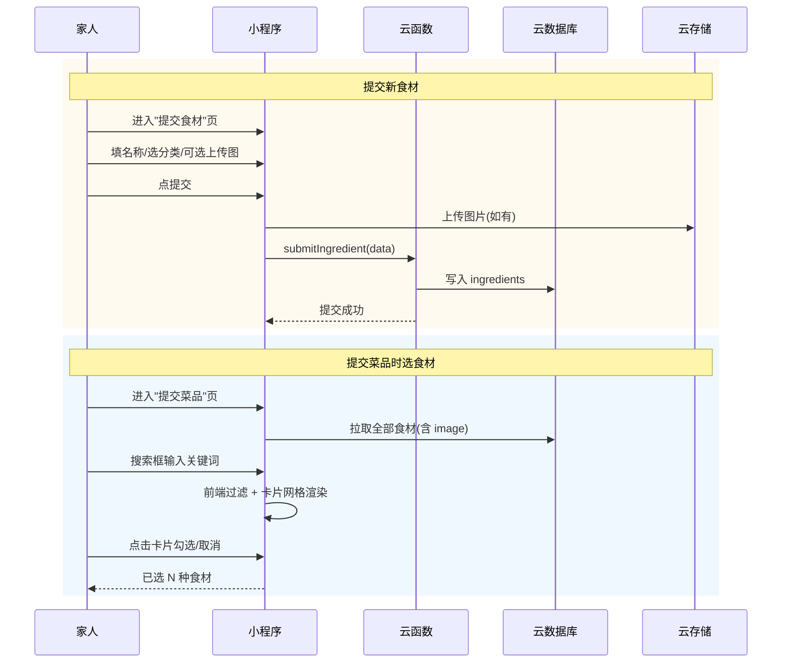

# 食材管理 Design

> Stage 1 | 2026-07-02

## 0. 术语约定

复用到现有术语，无新增。`ingredient` 新增 `image` 字段（云存储 fileID）。

## 1. 决策与约束

### 需求摘要

- **做什么**：家人可以提交新食材（名称 + 图片 + 分类）；提交菜品时食材选择器从纯文字标签改为搜索框 + 卡片网格（展示食材图片，方便查找）；食材图片可选但建议上传。
- **为谁**：所有家人（提交食材），所有家人（提交菜品时选食材）。
- **成功标准**：家人能独立提交食材并看到图片；在菜品提交页能通过搜索快速找到食材并看到食材长什么样。
- **明确不做**：食材审核流程（食材提交即生效，不需要审核）；食材编辑/删除；食材库存管理。

### 复杂度档位

走默认档位，无偏离。

### 关键决策

| 决策 | 选择 | 原因 |
|---|---|---|
| D1：食材提交权限 | 所有登录用户可提交，无需审核 | 食材是建菜的基础数据，家庭内部信任模型，提交即生效 |
| D2：食材图片 | 可选上传，存储在 `avatars/..` 同级的 `ingredients/` 路径 | 和菜品图片上传流程一致 |
| D3：食材选择器 UI | 搜索框 + 2 列卡片网格，每张卡显示食材图(或 emoji)+名称+选中勾 | 食材池几十种时文字标签难以浏览，图片+搜索大幅提升效率 |
| D4：页面位置 | 主包 `pages/submit-ingredient/index` | 和 `pages/submit/index` 同级，非审核人专属 |

### Top 3 风险

| 风险 | 缓解 |
|---|---|
| R1：食材图片上传后未提交就弃用，浪费存储 | 复用菜品图片的延迟上传模式——选图只压缩不传，提交时才上传 |
| R2：食材选择器卡片网格在小屏上拥挤 | 2 列布局 + 图片 120rpx 宽，3.5 寸屏也够 |
| R3：已有食材无 image 字段，卡片网格降级显示 | 无图时显示 emoji icon 或首字占位，不白屏 |

### 非显然依赖

- 无。食材数据已存在 `ingredients` 集合，本次只是扩展字段和新增 UI。

### 关键假设

- 假设 1：现有 `ingredients` 集合的 `icon` 字段（emoji）可作为无图食材的降级展示
- 假设 2：食材分类（category）已有固定值如"蔬菜""肉类""调味""豆制品""其他"，新食材从下拉选择

---

## 2. 名词与编排

### 2.1 名词层

**现状**：`ingredients` 集合字段 `{ _id, name, category, icon?, createdAt }`。前端 `Ingredient` 接口同样结构。提交菜品页中食材选择器为纯文字 tag 列表。

**变化**：

#### `ingredients` 集合 — 新增 image 字段

```js
{
  _id: string,
  name: string,         // "鸡蛋"、"西红柿"
  category: string,     // "蔬菜"、"肉类"、"调味"、"豆制品"、"其他"
  icon: string,         // 可选 emoji（保留兼容旧数据）
  image: string,        // 新增：可选，云存储 fileID
  createdAt: Date
}
```

#### 新增页面：`pages/submit-ingredient/index`

路由：`/pages/submit-ingredient/index`

入口：从「我的」→「➕ 提交新食材」或首页/提交菜品页跳转。

#### 菜品提交页食材选择器重构

从现有 tag 列表：
```
[🥩 猪肉] [🥬 白菜] [🥚 鸡蛋] [🫑 青椒] ...
```

改为：
```
┌─ 🔍 搜索食材... ──────────────┐
├───────────────────────────────┤
│ ┌──────────┐ ┌──────────┐    │
│ │   🥩      │ │   🥬      │    │
│ │  猪肉  ✓  │ │  白菜     │    │
│ └──────────┘ └──────────┘    │
│ ┌──────────┐ ┌──────────┐    │
│ │   🥚      │ │          │    │
│ │  鸡蛋     │ │  ...     │    │
│ └──────────┘ └──────────┘    │
└───────────────────────────────┘
已选 3 种食材：猪肉、白菜、鸡蛋
```

每张卡：图片(或 emoji 降级) + 名称 + 选中勾。搜索实时过滤。同一页面在菜品提交 form 的「所需食材」区域原地替换。

#### 新增云函数：`submitIngredient`

```
输入: { name, category, icon?, image? }
输出: { success: true, ingredient: { ...完整记录 } }
错误:
  { code: "MISSING_FIELDS", message: "食材名和分类不能为空" }
  { code: "DUPLICATE_NAME", message: "已存在同名食材" }
```

### 2.2 编排层

#### 主流程图



**文字版**：
> **提交食材**：用户进入提交食材页 → 填写名称、选分类、可选上传图片 → 提交时先上传图(如有)再调 submitIngredient 写入 DB
>
> **菜品页选食材**：进入提交菜品页 → 拉取全部食材(含 image) → 用户输关键词前端实时过滤 → 卡片网格展示(有图显图，无图显 emoji) → 点击卡片选中/取消 → 底部显示已选食材名称

#### 流程级约束

- **食材唯一性**：`submitIngredient` 在写入前查同名食材是否存在，存在则拒绝
- **图片延迟上传**：选图时只压缩暂存本地路径，提交时才上传云存储（和菜品图片模式一致）
- **食材数据刷新**：提交食材成功后返回上一页时，`menuStore.fetchAllIngredients()` 需重新拉取
- **搜索过滤**：前端实时过滤，匹配食材名（大小写不敏感），无需额外云函数调用

### 2.3 挂载点清单

| # | 挂载位置 | 动作 | 说明 |
|---|---|---|---|
| 1 | `pages.json` pages | 新增 `pages/submit-ingredient/index` 路由 | 提交食材页面 |
| 2 | `pages/mine/index` 菜单 | 新增「🥬 提交新食材」入口 | 所有用户可见 |
| 3 | 云函数部署 | 新增 `submitIngredient` 云函数 | 写入食材数据 |
| 4 | `pages/submit/index` 食材选择区 | 重构为搜索+卡片网格 | 原地替换现有 tag 列表 |

4 条，在正常区间内。卸载时删掉这 4 项即完全移除本 feature。

### 2.4 推进策略

```
1. 数据层扩展：ingredients 集合不需要改 schema（MongoDB 无 schema 约束），
   仅云函数 + 前端类型扩展 image 字段
   退出信号：type-check 通过

2. 云函数 submitIngredient：创建并本地验证
   退出信号：云函数逻辑完整，重复名检测可用

3. 提交食材页面：表单(名称+分类下拉+可选图片)+提交逻辑
   退出信号：npm run build 通过，页面可访问

4. 食材选择器重构：搜索框+卡片网格替换 tag 列表
   退出信号：菜品提交页食材选择正常，搜索过滤生效，图片/emoji 降级正常
```

### 2.5 结构健康度与微重构

**文件级**：
- `src/pages/submit/index.vue` — 当前约 212 行，食材选择区替换约增减持平。健康，不做微重构。
- `src/stores/menu.ts` — 当前 81 行。需新增 `fetchAllIngredients` 返回类型扩展 `image` 字段，改动量小。

**目录级**：
- `src/pages/` — 新增 `submit-ingredient/` 目录，同级已有 `submit/`，目录结构一致。

**结论**：本次不做微重构。原因：改动文件健康，新目录与现有结构一致。

---

## 3. 验收契约

### 关键场景清单

#### 正常路径

| # | 场景 | 输入/触发 | 期望结果 | 证据类型 |
|---|---|---|---|---|
| S1 | 提交新食材(无图) | 填名称"牛肉"+选分类"肉类"→提交 | 提交成功，ingredients 集合新增记录 | 截图+数据库 |
| S2 | 提交新食材(有图) | 填名称+选图+选分类→提交 | 图片上传云存储，ingredients 记录含 image fileID | 截图+数据库+云存储 |
| S3 | 重复食材名拒绝 | 提交已存在的"鸡蛋" | toast "已存在同名食材" | 截图 |
| S4 | 食材选择器搜索 | 在菜品提交页搜索"蛋" | 只显示含"蛋"的食材卡片(鸡蛋、鸭蛋...) | 截图 |
| S5 | 食材卡片勾选 | 点两张食材卡片 | 卡片边框变绿+勾，底部"已选 2 种食材" | 截图 |
| S6 | 食材图片展示 | 食材有 image 字段 | 卡片显示真实图片而非 emoji | 截图 |

#### 边界场景

| # | 场景 | 输入/触发 | 期望结果 |
|---|---|---|---|
| S7 | 食材无图片降级 | 食材无 image 但有 icon | 卡片显示 emoji 大图 |
| S8 | 食材无图无 icon | 食材既无 image 也无 icon | 卡片显示首字占位 |
| S9 | 搜索无结果 | 搜"xyz" | 显示"未找到匹配食材" |
| S10 | 空食材列表 | 数据库无任何食材时进菜品提交 | 显示"暂无食材，请先提交食材" |
| S11 | 提交食材缺必填 | 不填名称直接提交 | toast "请填写食材名和分类" |

#### 错误路径

| # | 场景 | 输入/触发 | 期望结果 |
|---|---|---|---|
| S12 | 图片上传失败 | 选图后提交，网络异常 | toast "图片上传失败"，食材仍写入(无图) |

### 明确不做的反向核对

| 不做项 | 反向核对方式 |
|---|---|
| 无食材审核 | 无 approval/review 状态字段或相关云函数 |
| 无食材编辑/删除 | 无 update/delete 操作入口或云函数 |

### Acceptance Coverage Matrix

| Scenario | Covered By Step | Evidence Type | Core? |
|---|---|---|---|
| S1 提交食材无图 | Step 3 | 截图+数据库 | yes |
| S2 提交食材有图 | Step 3 | 截图+数据库+云存储 | yes |
| S3 重复拒绝 | Step 3 | 截图 | no |
| S4 搜索过滤 | Step 4 | 截图 | yes |
| S5 卡片勾选 | Step 4 | 截图 | yes |
| S6 图片展示 | Step 4 | 截图 | yes |
| S7-S12 | Step 3/4 | 截图 | no |

### DoD Contract

| ID | 要求 | 证据 | 阻塞级别 |
|---|---|---|---|
| DOD-DESIGN-001 | design 完整 | 本 design + review passed | blocking |
| DOD-IMPL-001 | 4 steps exit_signal 通过 | checklist + 截图 | blocking |
| DOD-QA-001 | 12 个验收场景覆盖 | 截图 | blocking |

**Validation Commands:**

| ID | 命令 | 目的 | 核心性 |
|---|---|---|---|
| CMD-001 | `npm run type-check` | 类型检查 | core |
| CMD-002 | `npm run build:mp-weixin` | 编译通过 | core |

---

## 4. 与项目级架构文档的关系

本 feature 是 smart-menu 的子能力扩展：

- **名词变化**：`ingredients` 新增 `image` 字段 → acceptance 后更新 `CONTEXT.md` 食材条目
- **无新增 ADR**：食材免审核是设计 D1 的延续（家庭信任模型），不构成独立的架构决策
