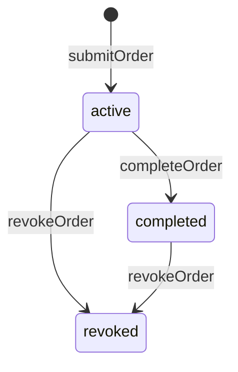
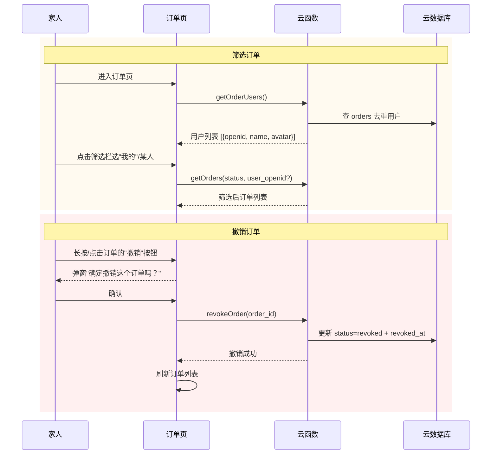

# 订单删除与按提交人筛选 Design

> Stage 1 | 2026-07-03

## 0. 术语约定

| 术语 | 定义 | 防冲突 |
|---|---|---|
| 撤销 (revoke) | 将订单状态从 `active`/`completed` 改为 `revoked`，数据保留不物理删除 | CONTEXT.md 已预留 `revoked` 终态——本次 **实现该状态**（此前仅定义未编码） |
| 筛选 (filter) | 按提交人（`user_openid`）维度过滤订单列表，不影响数据 | 新概念，无冲突 |
| 提交人 (submitter) | 下单的人，即订单的 `user_openid` 对应的人 | 与 CONTEXT.md「用户」一致 |

## 1. 决策与约束

### 需求摘要

- **做什么**：订单页增加两个能力——(1) 撤销订单（软删除，状态变 `revoked`）；(2) 按提交人筛选订单列表（全部 / 我的 / 某个家人）
- **为谁**：所有家庭成员
- **成功标准**：能撤销不需要的订单（误下单或不想做了）；能快速定位自己或某人的订单
- **明确不做**：硬删除（物理删记录）、订单编辑、按审核人角色筛选、撤销后恢复、批量撤销

### 复杂度档位

走默认档位。理由：两个独立的小功能，改动面窄（1 个页面 + 1 个 Store + 2-3 个云函数），无并发/性能挑战。

### 关键决策

| 决策 | 选择 | 原因 |
|---|---|---|
| D1：删除方式 | 软删除——新增 `revoked` 状态 | 保留数据可追溯；CONTEXT.md 原写"不设删除"，本次推翻 |
| D2：撤销权限 | 仅订单提交人可撤销自己的订单 | 撤销是提交人对自己订单的撤销权，与完成订单（任何人可完成）不同 |
| D3：撤销范围 | active 和 completed 都可以撤销 | 用户选了"软删除推荐"（含已完成订单也可撤销） |
| D4：筛选维度 | 按提交人 `user_openid` | 用户确认：全部 / 我的 / 某人的订单 |
| D5：筛选用户列表来源 | 从 orders 集合去重提取 | 只显示实际下过单的人，不用维护独立成员列表 |
| D6：已撤销订单展示 | 在历史 tab 中显示，带"已撤销"标记 | 与 completed 订单混排，透明度降低 + 标记文字区分 |

### 关键假设

- **假设 1**：家庭成员 3-10 人，订单总量在数百条级别，筛选用户列表去重性能无问题
- **假设 2**：撤销是终态——撤销后不可恢复、不可重新激活。如需"反撤销"由开发者在数据库手动改
- **假设 2b**：仅订单提交人可撤销自己的订单——与"完成订单"（任何人可完成）权限模型不同：完成是做饭的人标记做完，撤销是提交人撤销自己的下单
- **假设 3**：已撤销订单仍在历史列表中可见（而不单独开 tab），家庭场景不需要复杂的订单状态管理

### Top 3 风险

| 风险 | 缓解 |
|---|---|
| R1：撤销操作误触 | 前端加确认弹窗（`uni.showModal`），二次确认后才执行 |
| R2：getOrders 云函数改动影响现有调用 | `user_openid` 参数设为可选，不传时行为与现在完全一致 |
| R3：筛选用户列表在大量订单时去重性能 | 限制扫描最近 500 条订单去重，家庭场景足够；后续若超量再加索引 |

### 非显然依赖

- 无外部服务依赖
- 无数据迁移需求（`revoked` 是新增状态值，现有数据无需变更）
- `getOrders` 云函数改动需兼容现有调用方（order Store、可能的其他页面）

### 必跑验证命令

| 命令 | 目的 | 核心性 |
|---|---|---|
| `npm run build:mp-weixin` | 确认编译通过 | core |

基线预检：build 当前已通过（上次 commit `06da088` 编译成功），若预检红灯需区分既有问题/本次引入。

### 清洁度规则

- 禁止遗留 `console.log` 调试输出
- 禁止临时 TODO/FIXME 注释
- 禁止注释掉的代码
- 禁止无用 import

---

## 2. 名词与编排

### 2.1 名词层

#### 订单 (Order) — 现状

位置：`cloudfunctions/submitOrder/index.js` 写入、`cloudfunctions/getOrders/index.js` 读取、`cloudfunctions/completeOrder/index.js` 更新

```js
{
  _id: string,
  user_openid: string,
  user_name: string,
  user_avatar: string,
  items: [{ dish_id, dish_name, quantity }],
  status: 'active' | 'completed',   // ← 现状：仅两个状态被实际使用
  created_at: Date,
  completed_at: Date,                // 仅 completed 时有值
}
```

状态机现状（代码实际实现）：
```
active → completed   （completeOrder 云函数）
```
设计文档中预留了 `revoked` 但代码未实现。

#### 订单 (Order) — 变化

**状态机扩展**：



文字版：`active` → `completed`（完成）/ `revoked`（撤销）；`completed` → `revoked`（撤销）。`revoked` 是终态，不可再变更。

**Schema 变化**：新增 `revoked_at: Date` 字段（撤销时写入）。

#### 云函数接口

**`revokeOrder`** — 新增

```
// 来源：cloudfunctions/revokeOrder/index.js（新建）

输入: { order_id: "order_001" }
输出: { success: true, order: { _id, ...更新后的 order } }

错误:
  { code: "NOT_LOGGED_IN", message: "请先登录" }
  { code: "MISSING_ORDER_ID", message: "缺少订单 ID" }
  { code: "ORDER_NOT_FOUND", message: "订单不存在" }
  { code: "NOT_OWNER", message: "只能撤销自己的订单" }
  { code: "ALREADY_REVOKED", message: "该订单已被撤销" }
  { code: "REVOKE_FAILED", message: "撤销失败，请重试" }
```

实现要点：
- 校验 openid（登录态）
- 校验 order_id 非空
- 查询订单是否存在
- 校验订单的 `user_openid === OPENID`（仅提交人可撤销自己的订单）
- 校验当前状态不是 `revoked`（幂等保护）
- 更新 status → `revoked`，写入 `revoked_at`

**`getOrders`** — 扩展

```
// 来源：cloudfunctions/getOrders/index.js（修改）

输入: {
  status: 'active' | 'completed' | 'revoked' | ('completed' | 'revoked')[],  // ← 扩展支持数组
  page: 1,
  pageSize: 20,
  user_openid?: string,    // ← 新增可选参数
}
输出: { orders: [...], total: number, hasMore: boolean }

// status 为单值 → 现有行为不变（如进行中 tab 传 'active'）
// status 为数组 → 查询匹配任一状态的订单（如历史 tab 传 ['completed', 'revoked']）
// user_openid 不传 → 返回所有用户的订单
// user_openid 传入 → 只返回该用户的订单
```

实现要点：
- `status` 支持单值字符串或字符串数组；数组时用 `_.in(status)` 查询
- `user_openid` 为可选参数，不传时 where 条件仅含 `status`，传了则加 `user_openid` 过滤

**`getOrderUsers`** — 新增

```
// 来源：cloudfunctions/getOrderUsers/index.js（新建）

输入: {}
输出: {
  users: [
    { openid: "xxx", user_name: "张三", user_avatar: "https://..." },
    ...
  ]
}
```

实现要点：
- 校验 OPENID（登录态），与项目其他云函数保持一致
- 从 `orders` 集合查最近 500 条（按 `created_at` 降序），提取 `user_openid` + `user_name` + `user_avatar`
- 内存中去重（按 `user_openid`）
- 错误：`{ code: "NOT_LOGGED_IN" }`、`{ code: "QUERY_FAILED" }`

#### 前端 Store 接口

**`useOrderStore`** — 扩展

```ts
// 位置：src/stores/order.ts（修改）

// 新增操作：
revokeOrder(order_id: string): Promise<void>   // 调用 revokeOrder 云函数

// 扩展现有操作：
fetchActiveOrders(user_openid?: string): Promise<Order[]>
fetchHistoryOrders(page: number, user_openid?: string): Promise<{ orders, hasMore }>
fetchOrderUsers(): Promise<User[]>              // 调用 getOrderUsers 云函数
```

### 2.2 编排层

#### 主流程变化



文字版流程：

> **筛选**：用户进入订单页 → 顶部筛选栏显示"全部 | 我的 | 家人A | 家人B ..." → 点击切换 → 调用 getOrders 带 `user_openid` 参数 → 刷新列表
>
> **撤销**：用户在订单卡片上看到"撤销"按钮 → 点击弹出确认弹窗 → 确认后调用 revokeOrder 云函数 → 成功后 toast "已撤销" + 刷新当前列表

#### 筛选栏交互细节

- **「进行中」tab**：筛选栏可见，默认选中"全部"
- **「历史」tab**：筛选栏可见，默认选中"全部"（历史含 completed + revoked）
- **筛选状态为页面级**：两个 tab 共享同一个筛选用户选择——从"进行中"切到"历史"时保留当前选中用户，反之亦然。切换 tab 时自动用当前筛选条件重新请求
- **用户列表为空时**：筛选栏仅显示"全部"和"我的"两项
- **「全部」选项**：对应不传 `user_openid` 参数（可选参数语义：`undefined` = 不过滤）。前端在选中"全部"时调用 Store 方法不传 `user_openid`，云函数不追加 `user_openid` 过滤条件

#### 撤销按钮交互细节

- **位置**：订单卡片右下角，与现有"完成"按钮并列
- **可见性**：仅订单提交人（`user_openid === 当前用户 openid`）可见撤销按钮；其他人的订单不显示
- **进行中订单（本人）**：「完成」+「撤销」两个按钮
- **进行中订单（他人）**：仅「完成」按钮（与现在一致）
- **历史订单（本人，completed）**：「撤销」按钮
- **历史订单（他人，completed）**：无操作按钮
- **历史订单（revoked）**：无操作按钮，显示"已撤销"标记
- **确认弹窗**：`uni.showModal({ title: '撤销订单', content: '确定要撤销这个订单吗？' })`

#### 流程级约束

- **撤销幂等**：已撤销的订单再次撤销返回 `ALREADY_REVOKED`，前端拦截（不显示撤销按钮）
- **撤销失败处理**：云函数返回错误（网络异常 / REVOKE_FAILED / 其他）→ toast 显示具体错误信息，列表不刷新，订单状态保持不变
- **筛选 + 分页**：切换筛选条件时重置 page=1，清空已有列表重新加载
- **撤销后刷新**：撤销成功后重新请求当前筛选条件下的订单列表
- **兼容性**：`getOrders` 的 `status` 参数扩展支持数组后，单值调用行为不变；`user_openid` 参数可选——不传时行为与现在完全一致

### 2.3 挂载点清单

| # | 挂载位置 | 动作 | 说明 |
|---|---|---|---|
| 1 | `cloudfunctions/revokeOrder/` | 新增云函数 | 撤销订单 |
| 2 | `cloudfunctions/getOrderUsers/` | 新增云函数 | 获取下单用户列表 |
| 3 | `cloudfunctions/getOrders/index.js` | 修改 | 新增可选 `user_openid` 过滤参数 |
| 4 | `src/stores/order.ts` | 修改 | 新增 revokeOrder + getOrderUsers；扩展 fetch 参数 |
| 5 | `src/pages/order/index.vue` | 修改 | 新增筛选栏 UI + 撤销按钮 + 确认弹窗 + revoked 状态展示 |

5 条，在正常区间内。卸载时删除 2 个云函数、回退 1 个云函数的参数扩展、回退 Store 和页面的新增代码。

### 2.4 推进策略

```
1. revokeOrder 云函数：新建 cloudfunctions/revokeOrder/（index.js + package.json）
   退出信号：微信开发者工具云函数测试面板跑通——正常撤销 + 重复撤销返回 ALREADY_REVOKED + 不存在的订单返回 ORDER_NOT_FOUND

2. getOrders 扩展 + getOrderUsers 云函数：getOrders 新增可选 user_openid 参数；新建 getOrderUsers
   退出信号：getOrders 不带 user_openid 行为不变；带 user_openid 只返回该用户订单；getOrderUsers 返回去重用户列表

3. order Store 扩展：新增 revokeOrder / getOrderUsers / 扩展现有 fetch 方法签名
   退出信号：TypeScript 类型检查通过（如有）；代码 review 确认接口签名与云函数一致

4. 订单页 UI：筛选栏 + 撤销按钮 + 确认弹窗 + revoked 状态展示
   退出信号：编译通过 + 肉眼验证筛选栏渲染正确 + 撤销按钮位置正确

5. 边界态 + harden：空态（无订单/无筛选结果）、加载态、错误态、撤销幂等、筛选+分页重置
   退出信号：全部边界态肉眼验证通过；编译无 warning；无调试残留
```

### 2.5 结构健康度与微重构

#### 评估

**文件级**（要改的文件）：

| 文件 | 当前行数 | 改动后预估 | 职责数 | 评估 |
|---|---|---|---|---|
| `src/pages/order/index.vue` | 143 | ~250 | 筛选栏 + 订单卡片列表 + 撤销/完成操作 | 偏胖但未到必须拆的程度 |
| `src/stores/order.ts` | 52 | ~80 | CRUD 操作 | 健康 |
| `cloudfunctions/getOrders/index.js` | 38 | ~50 | 查询订单 | 健康 |

**目录级**（要落新文件的目标目录）：

| 目录 | 现有文件数 | 评估 |
|---|---|---|
| `cloudfunctions/` | 18 个 | 健康，按功能平铺是项目既有约定 |

#### 结论：不做微重构

原因：
- 订单页 ~250 行仍在可维护范围内（单文件，职责清晰：展示+操作）
- Store 和云函数改动量小、职责不混杂
- 若后续订单页继续膨胀（如加评论、加详情），再拆出 `<OrderCard>` 和 `<OrderFilter>` 组件——本次不做预防性拆分
- 如果 Step 4 实现时发现模板/逻辑复杂度超出预期，允许主动拆出 `<OrderFilter>` 子组件（筛选栏独立），但仍属于 implement 自决范围

---

## 3. 验收契约

### 关键场景清单

#### 正常路径

| # | 场景 | 输入/触发 | 期望结果 | 证据类型 |
|---|---|---|---|---|
| S1 | 撤销进行中订单 | 进行中订单点「撤销」→ 确认弹窗点确定 | 订单从进行中列表消失，历史列表中可见状态为 revoked | 截图 + 数据库 |
| S2 | 撤销已完成订单 | 历史订单（completed）点「撤销」→ 确认 | 订单状态变 revoked，显示"已撤销"标记 | 截图 + 数据库 |
| S3 | 筛选「我的」订单 | 筛选栏选「我的」 | 只显示当前用户提交的订单 | 截图 |
| S4 | 筛选某个家人 | 筛选栏选某家人头像/名字 | 只显示该家人的订单 | 截图 |
| S5 | 筛选 + tab 切换 | 在「我的」筛选下切换到历史 tab | 历史 tab 也应用「我的」筛选 | 截图 |
| S6 | 撤销后自动刷新 | 撤销订单成功后 | 列表自动刷新，不展示已撤销订单（进行中 tab） | 截图 |

#### 边界场景

| # | 场景 | 输入/触发 | 期望结果 |
|---|---|---|---|
| S7 | 撤销已撤销的订单 | 在 revoked 订单上无撤销按钮 | 前端不展示撤销按钮，即使用户绕过去调云函数返回 ALREADY_REVOKED |
| S8 | 筛选无结果 | 选一个没有订单的筛选条件 | 列表为空，显示"暂无订单"空态 |
| S9 | 只有一个人下过单 | 筛选栏用户列表 | 显示"全部"+"我的"+这一个人 |
| S10 | 撤销确认撤销 | 弹窗点撤销 | 不执行撤销操作，订单状态不变 |
| S11 | 进行中 tab 筛选后切换回全部 | 筛选「我的」→ 切回「全部」 | 重新显示所有进行中订单 |
| S12 | 网络异常时撤销 | revokeOrder 云函数超时 | toast "网络异常请重试"，订单状态不变 |

#### 错误路径

| # | 场景 | 输入/触发 | 期望结果 |
|---|---|---|---|
| S13 | 未登录调 revokeOrder | 未登录直接调云函数 | 返回 NOT_LOGGED_IN |
| S14 | 非本人撤销 | A 用户尝试撤销 B 用户的订单 | 返回 NOT_OWNER |
| S15 | 缺少 order_id | revokeOrder 不传 order_id | 返回 MISSING_ORDER_ID |

### 明确不做的反向核对

| 不做项 | 反向核对方式 |
|---|---|
| 无硬删除 | 无 `db.collection('orders').doc(x).remove()` 调用 |
| 无撤销后恢复 | `revokeOrder` 只写 `status='revoked'`，无逆向操作 |
| 无批量撤销 | 前端无多选/全选，云函数只接受单个 order_id |
| 无订单编辑 | 无 updateOrder 云函数 |
| 无按审核人角色筛选 | 筛选逻辑只用 `user_openid`，不读 `isApprover` |

### Acceptance Coverage Matrix

| Scenario | Covered By Step | Evidence Type | Core? |
|---|---|---|---|
| S1 撤销进行中 | Step 4 | 截图 + 数据库 | yes |
| S2 撤销已完成 | Step 4 | 截图 + 数据库 | yes |
| S3 筛选我的 | Step 4 | 截图 | yes |
| S4 筛选某人 | Step 4 | 截图 | yes |
| S5 筛选+tab切换 | Step 4 | 截图 | yes |
| S6 撤销后刷新 | Step 4 | 截图 | yes |
| S7-S12 边界 | Step 5 | 截图 | no |
| S13-S14 错误 | Step 5 | diff review | yes |

### DoD Contract

| ID | 要求 | 证据 | 阻塞级别 |
|---|---|---|---|
| DOD-DESIGN-001 | design 完整且关键契约可执行 | design review passed | blocking |
| DOD-IMPL-001 | 5 个 step 全部 exit_signal 通过 | checklist + 截图 | blocking |
| DOD-QA-001 | 14 个验收场景全部覆盖 | 截图 + diff review | blocking |

**Validation Commands:**

| ID | 命令 | 目的 | 核心性 | 失败处理 |
|---|---|---|---|---|
| CMD-001 | `npm run build:mp-weixin` | 确认编译通过 | core | fix-or-block |

**Required Artifacts:** design-review report, checklist completion log, page screenshots (筛选栏各状态 + 撤销操作流程 + revoked 展示), cloud function test evidence.

---

## 4. 与项目级文档关系

本 feature 是增量功能，对项目级文档的影响：

- **CONTEXT.md**：需更新订单术语——状态机描述改为"`active` → `completed` / `revoked`（revoked 已实现）"，订单 schema 字段列表新增 `revoked_at`；删除"不设删除"约束描述（该约束本意是不做物理删除，与本次软删除一致，无需保留此条）
- **无新 ADR**：撤销权限沿用家庭信任模型，不引入新结构性决策
- **setup-guide.md**：云函数数量需更新（+2 = 20 个）
